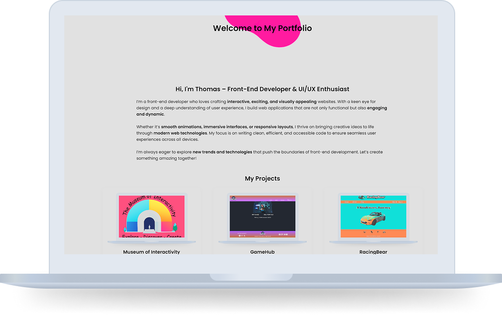

# 🌐 Front-End Developer Portfolio  
  

A sleek and interactive portfolio showcasing my front-end development projects, skills, and experience. Built to highlight my passion for **interactive, visually appealing, and engaging** web experiences.  

---

## 📖 **Description**  
This project is my personal portfolio website, designed to display my **skills, projects, and contact information** in a modern and responsive format. The goal was to create a dynamic and engaging user experience that reflects my expertise in **front-end development**.  

### 🔹 **Features**  
- Interactive and responsive design  
- Smooth animations and hover effects  
- Project showcase with live demo and GitHub links  
- Custom **liquid metaballs animation** in the background  
- Contact section with social media links  
- Fully optimized for mobile and desktop  

---

## 🛠️ **Built With**  
- **HTML5**  
- **CSS3** (Including Flexbox & Grid)  
- **JavaScript (ES6)**  
- **SVG & CSS Filters** (for the liquid metaballs effect)  

---

## 🚀 **Getting Started**  

### 📥 Installing  
To get a local copy up and running, follow these steps:  

1. Clone the repository:  
   ```sh
   git clone https://github.com/yourusername/portfolio.git
2. Open the index.html file in your preferred browser.

---

## ▶️ Running the Project
Since this is a static HTML, CSS, and JavaScript project, no additional setup is required. Simply open index.html in a browser.

---

## 🤝 Contributing
Contributions are welcome! If you’d like to contribute:

Fork the repository
1. Create a new branch (git checkout -b feature-branch)
2. Commit your changes (git commit -m 'Add new feature')
3. Push to the branch (git push origin feature-branch)
4. Open a Pull Request

---

## 📬 Contact
Feel free to reach out through:

[](https://linkedin.com/in/bjørn-thomas-torvund-723189a7)
[](https://twitter.com/thomastorvund)
[](mailto:bjorn.thomas.torvund@gmail.com)
